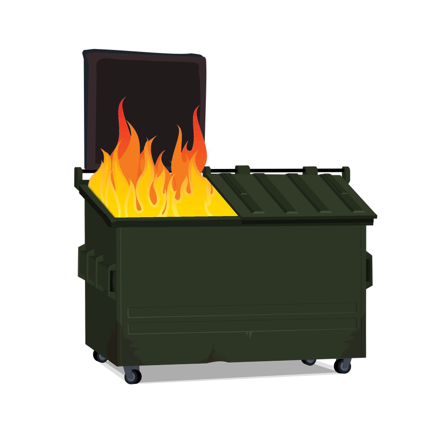

# dumpster-fire
A programming language designed from the ground up to make developers lose all semblance of sanity.

## Implementation Ideas
- Create LLVM front-end.
- Create a lexer/transpiler to generate C code.

## Ideas

- No include files, you have to copy and paste the contents of the library into every file
- loosely typed
- variable names may contain special characters
- no compiler warnings
- type names are numbers
- -*/ = 3 is a valid line
- as long as it is 3 characters in sequence that means it is a var
- values have to be written out in English!
- strings must end with a period
- No string concatenation
- 80 character line width limit
- no tabs, only spaces for code formatting
- Alternating character line width limit.
- no whitespace allowed at the start of a line
- Arrays start at 1
- no comments at all
- generate an error on unused vars at compile time
- all errors are numeric error codes with no explaination, requiring lookup in the developer guide
  - Developer guide will be in some sort of proprietary help format that will require a download.
